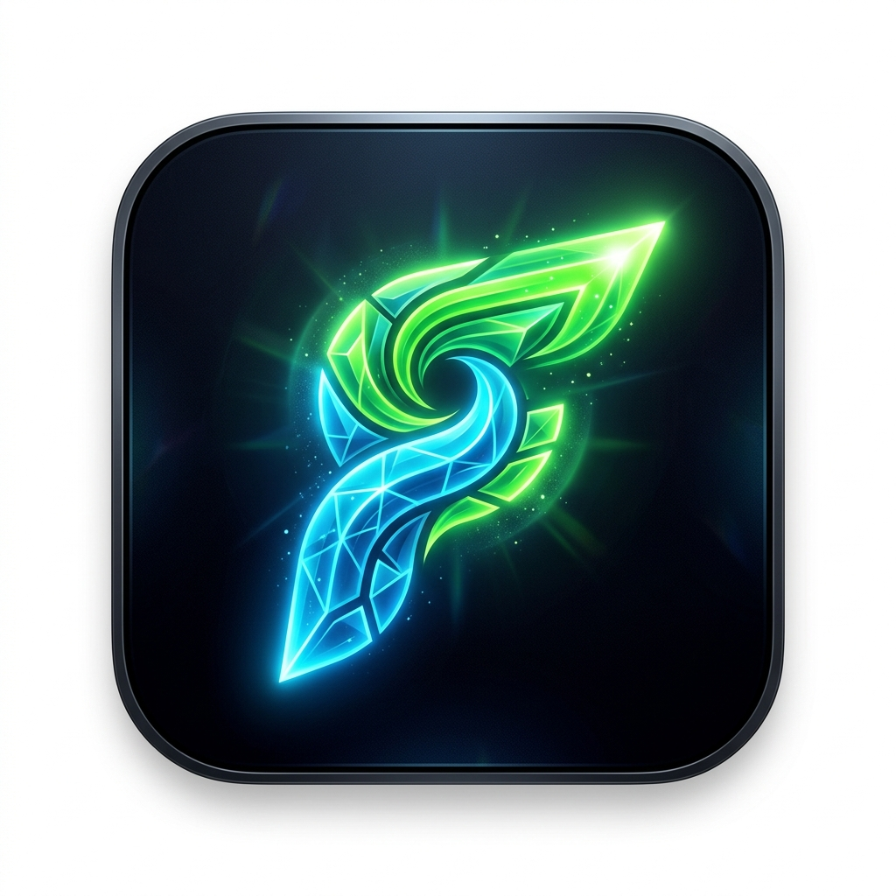

<div align="center">
  
  <h1>Karaneeyaani</h1>
  
  <p><b>A flow-driven, premium task management ecosystem built with Flutter and Firebase.</b></p>

  <p>
    
    
    
  </p>

  <p>
    <em>Karaneeyaani goes beyond traditional, stressful task lists. By grounding its core features in cognitive psychology, behavioral science, and responsive architecture, it actively reduces procrastination and induces flow states.</em>
  </p>
</div>

<br />

## ✨ Key Features

### 🎨 Premium Aesthetics & UI
- **Glassmorphic Landing Screen**: Enter your flow state immediately with a beautiful, transparent, and vibrant welcome screen offering quick "New Task" and "New Goal" actions.
- **Responsive Architecture**: Fully adaptive layout that shape-shifts between a single-column mobile interface and a multi-column, permanent-sidebar desktop experience.
- **Thematic Engine**: Built-in dynamic theming with psychologically brilliant colors designed to trigger dopamine and alert flow states. Switch between modes instantly from the elegant sidebar menu.
- **High-Contrast Glassmorphism**: Beautiful task cards with prominent background tints, glowing drop shadows, and distinct pill-shaped date/time badges that jump out against deep dark backgrounds.

### 🧠 Cognitive Task Management
- **Goals & Projects**: Hierarchical task tracking allowing you to group tasks into overarching Goals. Goals automatically mark themselves complete when all linked tasks are finished, gamifying the execution process.
- **Daily Roadmap**: Start your day right with a clear view of your tasks, dynamically sorted by time and date. Features manual drag-and-drop reordering.
- **Future Timeline**: A sleek, sorted calendar view of all your upcoming tasks and deadlines grouped neatly by days and months.
- **Smart Calendar**: A beautifully redesigned, professional calendar screen with a scrolling date ribbon that dynamically visualizes your daily load with task and goal indicator dots.
- **Time Boxing & Alarms**: Allocate specific time slots to tasks to maximize your productivity. Never miss a deadline with robust alarm integration.
- **Realistic Completed Tasks UI**: Grounded, clean Material Design for tasks you've conquered.

### ⚡ Offline-First & Resilient
- **Zero-Lag Architecture**: Instantaneous local ID generation guarantees zero UI freezing or lag when creating tasks during network drops. The app fires and forgets, syncing seamlessly in the background when your connection stabilizes.
- **Smart Notification Ecosystem**: Wake-lock alarms trigger on time even when the screen is off or the app is closed. Dismissing an alarm instantly completes the task in the database, while displaying motivational quotes to drive action.

### 🔒 Security & Data Integrity
- **5-Day Recycle Bin**: Soft-delete feature keeps your deleted tasks safely in the bin for 5 days before permanently erasing them.
- **Secure Authentication Flow**: Secure user accounts with Firebase Auth and strict Firestore security rules isolating each user's data. Automatically routes new users to a streamlined registration portal.

---

## 🚀 Getting Started

### Prerequisites
Before you begin, ensure you have the following installed:
- [Flutter SDK](https://docs.flutter.dev/get-started/install) (latest stable version)
- A [Firebase Project](https://console.firebase.google.com/) configured for Android/iOS

### Installation

1. **Clone the repository:**
   ```bash
   git clone https://github.com/AniruddhaMJois/karaneeyani.git
   cd karaneeyani
   ```

2. **Install dependencies:**
   ```bash
   flutter pub get
   ```

3. **Connect to Firebase:**
   ```bash
   dart pub global activate flutterfire_cli
   flutterfire configure
   ```
   *(Follow the prompts to link the app to your specific Firebase project)*

4. **Run the app:**
   ```bash
   flutter run
   ```

---

## 🔬 The Science Behind the App

> **The Zeigarnik Effect**: Unfinished tasks create cognitive tension. This app is designed to capture everything instantly to offload that burden.

> **Implementation Intentions**: Planning *when* and *where* a task will be done significantly increases success rates. The integrated smart alarm system ensures every task has a concrete intention.

> **Color Psychology**: The "Focus State" theme utilizes high-contrast neon elements against pure blacks to maintain alertness and simulate a high-end, premium deep-work environment.

---

<div align="center">
  <p>Built with ❤️ for peak productivity.</p>
</div>
